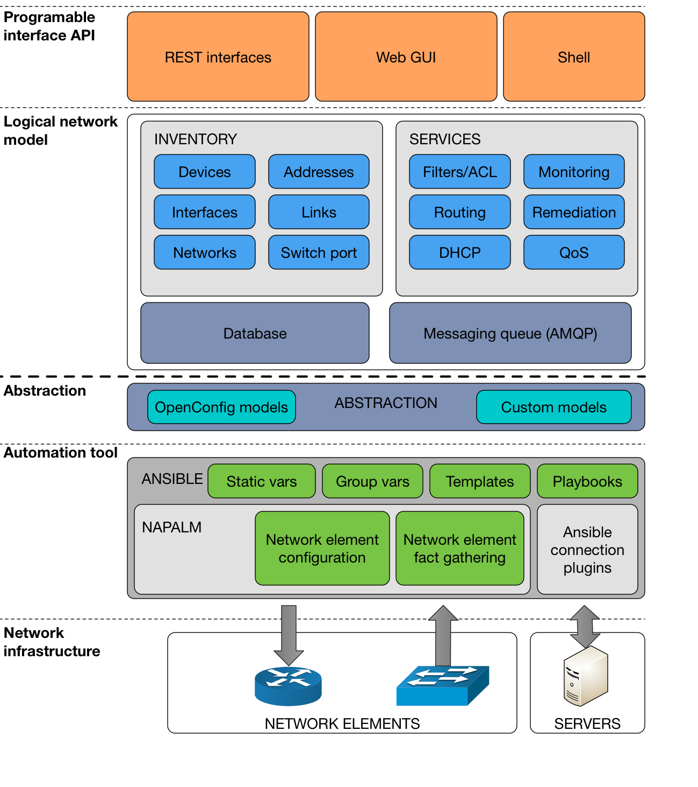
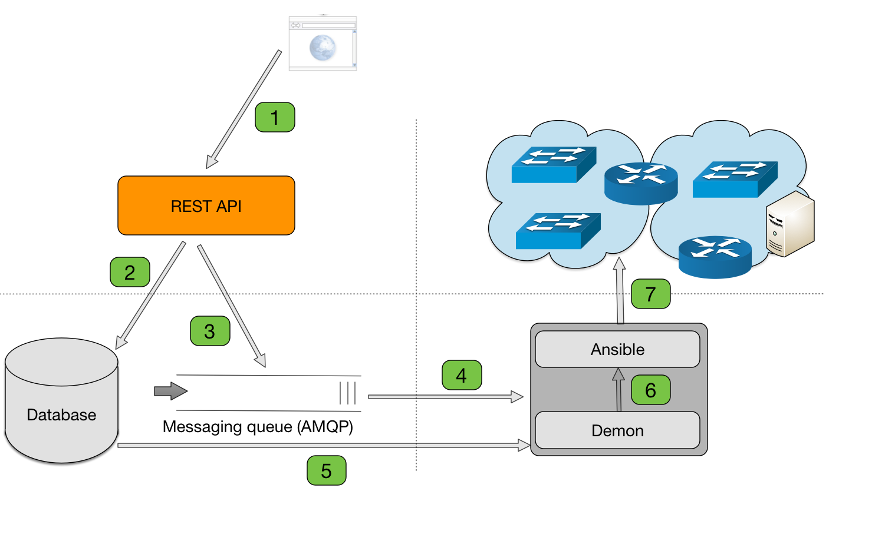

# AUTOMATOR

## Author: Blaž Divjak <blaz@divjak.si>
## Contributors: Gregor Cimerman <gregor@cime.si>
## Date: 1.11.2016
## Version: v0.1

Tool for uniform infrastructure for network and service management. Using **Ansible**, **OpenConfig**, **Django** and **AMQP** to simplify network automation.

## Architecture overview



## Configuration workflow



## Modules

### Inventory

* Device types
* Device information
* Interfaces
* Switchport settings
* Networks
* Addresses
* Links

### ISC DHCP Service

* DHCP Service for networks IPv4, IPv6
* Subnet and range
* Fixed hosts
* Custom Options
* IP Helper configuration

### REST API

Every module has its own API. It can be explored via. swagger gui interface at **/schema/** url address for each API.

* Authentication: /api/v1/auth/schema/
* Tenants: /api/v1/tenants/schema/
* Inventory: /api/v1/inventory/schema/
* DHCP service: /api/v1/dhcp/schema/

## Models

OpenConfig YANG models are used for network configuration data representation.
 
* interfaces
* vlan
* relay-agent

Custom models

* system configuration
* dhcp service configuration

## Roles

Includes roles for network devices and services.

### Services

* dhcp
* elk

### Network devices

* interfaces
* relay-agent
* system
* vlans

## User roles and permissions

### User roles

* Admin - Staff inside user with permissions to all objects in database
* Technician: Technical person with a group that could have assigned special object and tenant permissions
* User - Normal user with permissions assigned for a specific Tenant and its objects (e.g. Devices, Projects, Locations, ...). Every user is a member of User group.

### Permissions

Permissions can be assigned dynamicaly per object based on usecase. Supported permissions for each object. 

* Can view
* Can add
* Can change
* Can delete

Any user can have specific permissions asigned to them manualy using Django Admin interface od Django Shell. But it is discouraged ;).

_Additionaly based on serializer class defined for a specific view, different attributes can be modified for each object based on user permission_

#### Permission assignment
1. **ObjectPermission's:** As new object is added to tenant. Permissions are automaticaly assigned to **group** for this tenant. All users affiliated with this tenant are in the group.
2. **Admin's:** Have staff flag set in are staff and have full permissions for all objects in the database.

## Installation and configuration
 
Build automator image.

```
make build
```

Start automator development environment with all supporting services. Enter `password` for admin user when prompted.

```
make run
```

Destroy development environment and clean it up.

```
make clean
```
 
Access the development environment: http://localhost:8000

### Enable Django signals before usage!!!!!!
Change configuration in settings.py.
```
AUTOMATOR_ENABLE = True
```
